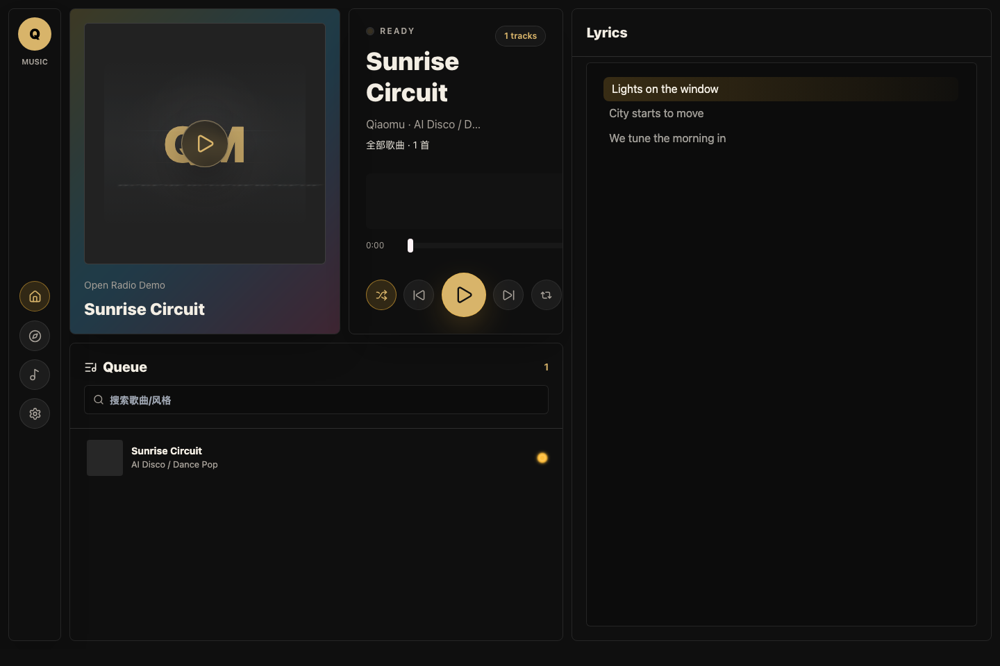
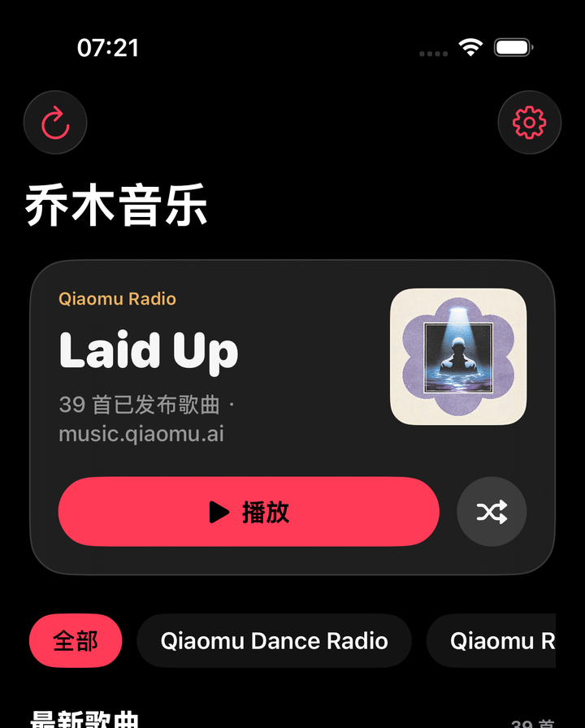

# Qiaomu Music Player Web

> 给 AI 生成音乐一个可自托管的电台前台和后台曲库。
> A self-hosted web radio and admin shelf for AI-generated music.

[](https://github.com/joeseesun/qiaomu-music-player-web/stargazers)
[](https://github.com/joeseesun/qiaomu-music-player-web/forks)
[](https://github.com/joeseesun/qiaomu-music-player-web/issues)
[](https://github.com/joeseesun/qiaomu-music-player-web/commits/main)
[](LICENSE)
[](https://vercel.com/new/clone?repository-url=https://github.com/joeseesun/qiaomu-music-player-web)

[Live Demo](https://music.qiaomu.ai) · [iOS App](ios/QiaomuMusic) · [Public API](#公开播放-api) · [License](LICENSE)





**[中文](#中文) | [English](#english)**

---

<a name="中文"></a>
## 中文

你用 Suno、Udio 或其他 AI 音乐工具生成了一堆歌，最后常常散落在下载目录、聊天记录和临时脚本里。

Qiaomu Music Player Web 把它们放进一个可以自托管的网页电台：前台负责播放、队列、歌词和视觉动效，后台负责上传、编辑、试听、发布和下架。

如果你只想听歌，也可以用仓库里的 SwiftUI iPhone 客户端读取公开播放 API，像 Apple Music 一样浏览、搜索和播放自己的 AI 歌曲库。

### 核心功能

- 电台前台：播放队列、封面、歌词滚动、主题配色和声纹动效。
- 后台曲库：上传音频、封面、歌词和元数据。
- iOS 客户端：SwiftUI、AVPlayer、锁屏控制、后台播放、歌词点按跳转。
- 公开播放 API：已发布歌曲可被其他网站、移动客户端和嵌入组件读取。
- 草稿试听：后台未发布歌曲也可以试听，不影响前台电台。
- 发布控制：一键发布或取消发布，并给出明确反馈。
- 本地存储：音频在 `data/music`，封面在 `data/covers`，元数据在 `data/tracks.json`。
- 自托管友好：Node 服务、Docker Compose 和静态前端构建都在仓库里。

### 快速开始

前置条件：

- [ ] 安装 Node.js 20 或更高版本：`node --version`
- [ ] 安装 npm：`npm --version`
- [ ] 准备一个后台密码，设置为 `ADMIN_PASSWORD`

本地运行：

```bash
npm install
ADMIN_PASSWORD="$(openssl rand -base64 24)" npm start
```

开发模式：

```bash
npm install
ADMIN_PASSWORD=replace-with-local-password npm run dev:server
npm run dev
```

打开 `http://127.0.0.1:5173`。点击设置里的后台入口，用你设置的 `ADMIN_PASSWORD` 登录。

### Docker 部署

```bash
export ADMIN_PASSWORD="$(openssl rand -base64 24)"
export SESSION_SECRET="$(openssl rand -base64 32)"
docker compose up -d --build
```

默认服务监听 `127.0.0.1:3068`。如果你要公开到互联网，建议放在 Caddy、Nginx 或 Cloudflare Tunnel 后面，并启用 HTTPS。

### 环境变量

复制 `.env.example` 作为本地参考，但不要提交真实 `.env`。

| 变量 | 必填 | 说明 |
| --- | --- | --- |
| `ADMIN_PASSWORD` | 是 | 后台登录密码，也用于 legacy upload token。 |
| `SESSION_SECRET` | 否 | Cookie 签名密钥。生产环境建议显式设置。 |
| `PORT` | 否 | HTTP 端口，默认 `3068`。 |
| `DATA_DIR` | 否 | 数据目录，默认 `./data`。 |
| `MAX_UPLOAD_BYTES` | 否 | 最大上传体积，默认 `120MB`。 |

### 截图更新

README 截图使用模拟曲库生成，不会读取你的真实歌曲数据。

```bash
npm run dev
SCREENSHOT_URL=http://127.0.0.1:5173 npm run capture:screenshots
```

输出文件在 `docs/assets/product-screenshot.png`。

### 数据和隐私

公开仓库不会包含上传的歌曲、封面、真实曲库、`.env`、`suno-jobs/` 或 `cover-redesigns/` 生成任务目录。

默认 `.gitignore` 已排除：

- `data/music/*`
- `data/covers/*`
- `data/tracks.json`
- `.env` 和 `.env.*`
- `suno-jobs/`
- `cover-redesigns/`

### Legacy Upload API

旧脚本仍可用：

```bash
curl -X PUT \
  -H "content-type: audio/mpeg" \
  -H "x-upload-token: $ADMIN_PASSWORD" \
  --data-binary @song.mp3 \
  "http://127.0.0.1:3068/api/upload?title=Demo&artist=Qiaomu"
```

新项目建议优先用后台页面上传。

### 公开播放 API

已发布歌曲可以被其他网站读取和播放。公开接口默认返回绝对 URL，并带有 CORS 响应头。

```bash
curl http://127.0.0.1:3068/api/public
curl http://127.0.0.1:3068/api/public/tracks
curl http://127.0.0.1:3068/api/public/tracks/TRACK_ID
curl http://127.0.0.1:3068/api/public/tracks/TRACK_ID/lyrics
```

嵌入播放器：

```html
<script defer src="https://music.example.com/embed/player.js"></script>
<qiaomu-music-player track="TRACK_ID"></qiaomu-music-player>
```

不写 `track` 时，播放器会自动播放公开列表里的第一首歌。组件支持 CSS 变量定制，例如 `--qiaomu-player-accent`、`--qiaomu-player-bg`、`--qiaomu-player-text` 和 `--qiaomu-player-lyrics-height`。

### iOS 客户端

仓库内置一个 SwiftUI iPhone 客户端，默认连接 `https://music.qiaomu.ai` 的公开播放 API，也可以在设置页切到本地 `http://127.0.0.1:3068`。

```bash
open ios/QiaomuMusic/QiaomuMusic.xcodeproj
```

命令行验证：

```bash
xcodebuild -project ios/QiaomuMusic/QiaomuMusic.xcodeproj -target QiaomuMusic -configuration Debug -sdk iphonesimulator build
xcodebuild -project ios/QiaomuMusic/QiaomuMusic.xcodeproj -target QiaomuMusic -configuration Debug -sdk iphoneos CODE_SIGNING_ALLOWED=NO build
```

已验证能力：曲库拉取、真实封面加载、`AVPlayer` 串流播放、后台音频、锁屏控制、歌词接口和点按跳转。

### 实测验证

最近一次发布前执行过：

```bash
npm run check
xcodebuild -project ios/QiaomuMusic/QiaomuMusic.xcodeproj -target QiaomuMusic -configuration Debug -sdk iphonesimulator build
xcodebuild -project ios/QiaomuMusic/QiaomuMusic.xcodeproj -target QiaomuMusic -configuration Debug -sdk iphoneos CODE_SIGNING_ALLOWED=NO build
curl https://music.qiaomu.ai/api/public
```

### Troubleshooting

| 问题 | 解决方式 |
| --- | --- |
| 登录返回 `admin_not_configured` | 启动服务时没有设置 `ADMIN_PASSWORD`。重新设置环境变量后重启。 |
| 上传后前台看不到歌曲 | 后台确认歌曲处于“已发布”；未发布歌曲只在后台可见。 |
| 音频无法播放 | 检查文件类型是否为 MP3、WAV、M4A、AAC、FLAC 或 OGG，并确认反向代理支持 Range 请求。 |
| Docker 启动失败 | `docker compose` 会要求 `ADMIN_PASSWORD`，请先 `export ADMIN_PASSWORD=...`。 |

### 致谢

界面基于 React、Vite、Tailwind CSS、Lucide React 和 `@nafr/echo-ui` 构建。

---

<a name="english"></a>
## English

AI-generated songs often end up scattered across downloads, chat logs, and one-off scripts.

Qiaomu Music Player Web turns that pile into a self-hosted web radio: a public player for listening, queueing, lyrics, and visual polish, plus an admin shelf for upload, metadata editing, preview, publishing, and unpublishing.

The repository also includes a SwiftUI iPhone app that reads the public playback API and offers an Apple Music inspired browsing, search, lyrics, and playback experience.

### Features

- Public radio UI with queue, lyrics, cover art, themes, and audio-reactive visuals.
- Admin library for audio, cover art, lyrics, and metadata uploads.
- SwiftUI iOS client with AVPlayer streaming, background audio, lock-screen controls, and tap-to-seek lyrics.
- Public playback API for websites, mobile apps, and embeddable players.
- Draft preview in admin, even when a track is not published.
- Explicit publish and unpublish actions with visible feedback.
- Local filesystem storage for music, covers, and metadata.
- Node server, Docker Compose, and Vite frontend in one small repo.

### Quick Start

Prerequisites:

- [ ] Node.js 20 or newer: `node --version`
- [ ] npm: `npm --version`
- [ ] A strong admin password in `ADMIN_PASSWORD`

Run locally:

```bash
npm install
ADMIN_PASSWORD="$(openssl rand -base64 24)" npm start
```

Development mode:

```bash
npm install
ADMIN_PASSWORD=replace-with-local-password npm run dev:server
npm run dev
```

Open `http://127.0.0.1:5173`, go to settings, then open the admin panel.

### Docker

```bash
export ADMIN_PASSWORD="$(openssl rand -base64 24)"
export SESSION_SECRET="$(openssl rand -base64 32)"
docker compose up -d --build
```

The default bind address is `127.0.0.1:3068`. Put it behind HTTPS before exposing it publicly.

### Environment

Use `.env.example` as a template. Never commit real `.env` files.

| Variable | Required | Notes |
| --- | --- | --- |
| `ADMIN_PASSWORD` | Yes | Admin login password and legacy upload token. |
| `SESSION_SECRET` | No | Cookie signing secret. Recommended in production. |
| `PORT` | No | HTTP port, defaults to `3068`. |
| `DATA_DIR` | No | Data directory, defaults to `./data`. |
| `MAX_UPLOAD_BYTES` | No | Upload limit, defaults to `120MB`. |

### Screenshot

The README screenshot is generated with mocked demo tracks, so it does not read private music data.

```bash
npm run dev
SCREENSHOT_URL=http://127.0.0.1:5173 npm run capture:screenshots
```

### Privacy Notes

The public repository excludes uploaded audio, covers, real metadata, `.env` files, and generated Suno job folders.

### Public Playback API

Published tracks can be fetched and played from other websites. Public API responses use absolute URLs and include CORS headers.

```bash
curl http://127.0.0.1:3068/api/public
curl http://127.0.0.1:3068/api/public/tracks
curl http://127.0.0.1:3068/api/public/tracks/TRACK_ID
curl http://127.0.0.1:3068/api/public/tracks/TRACK_ID/lyrics
```

Embeddable player:

```html
<script defer src="https://music.example.com/embed/player.js"></script>
<qiaomu-music-player track="TRACK_ID"></qiaomu-music-player>
```

Omit `track` to load the first published track. Style the web component with CSS variables such as `--qiaomu-player-accent`, `--qiaomu-player-bg`, `--qiaomu-player-text`, and `--qiaomu-player-lyrics-height`.

### iOS App

The bundled SwiftUI iPhone app defaults to `https://music.qiaomu.ai` and can be switched to a local server from Settings.

```bash
open ios/QiaomuMusic/QiaomuMusic.xcodeproj
```

CLI validation:

```bash
xcodebuild -project ios/QiaomuMusic/QiaomuMusic.xcodeproj -target QiaomuMusic -configuration Debug -sdk iphonesimulator build
xcodebuild -project ios/QiaomuMusic/QiaomuMusic.xcodeproj -target QiaomuMusic -configuration Debug -sdk iphoneos CODE_SIGNING_ALLOWED=NO build
```

### Verification

The current release was checked with:

```bash
npm run check
xcodebuild -project ios/QiaomuMusic/QiaomuMusic.xcodeproj -target QiaomuMusic -configuration Debug -sdk iphonesimulator build
xcodebuild -project ios/QiaomuMusic/QiaomuMusic.xcodeproj -target QiaomuMusic -configuration Debug -sdk iphoneos CODE_SIGNING_ALLOWED=NO build
curl https://music.qiaomu.ai/api/public
```

### Troubleshooting

| Problem | Fix |
| --- | --- |
| Login returns `admin_not_configured` | Start the server with `ADMIN_PASSWORD` set. |
| Uploaded track does not appear in radio | Publish it from the admin library. Drafts are admin-only. |
| Audio does not play | Check the file type and make sure your proxy supports Range requests. |
| Docker refuses to start | Export `ADMIN_PASSWORD` before running `docker compose up`. |

### Credits

Built with React, Vite, Tailwind CSS, Lucide React, and `@nafr/echo-ui`.
